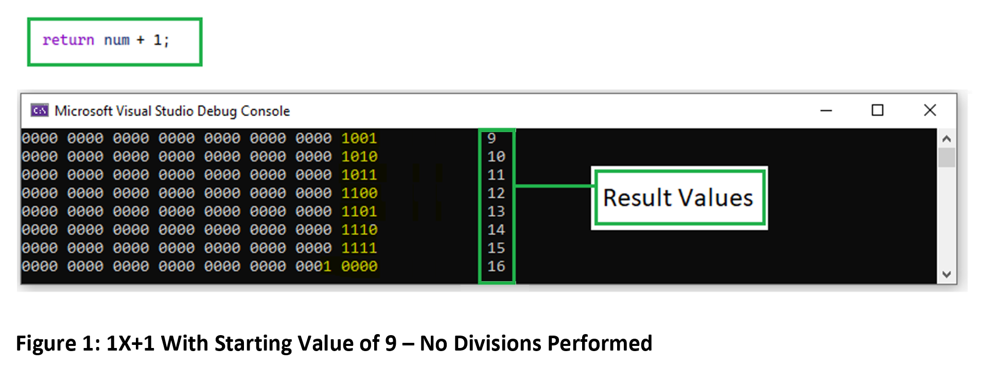
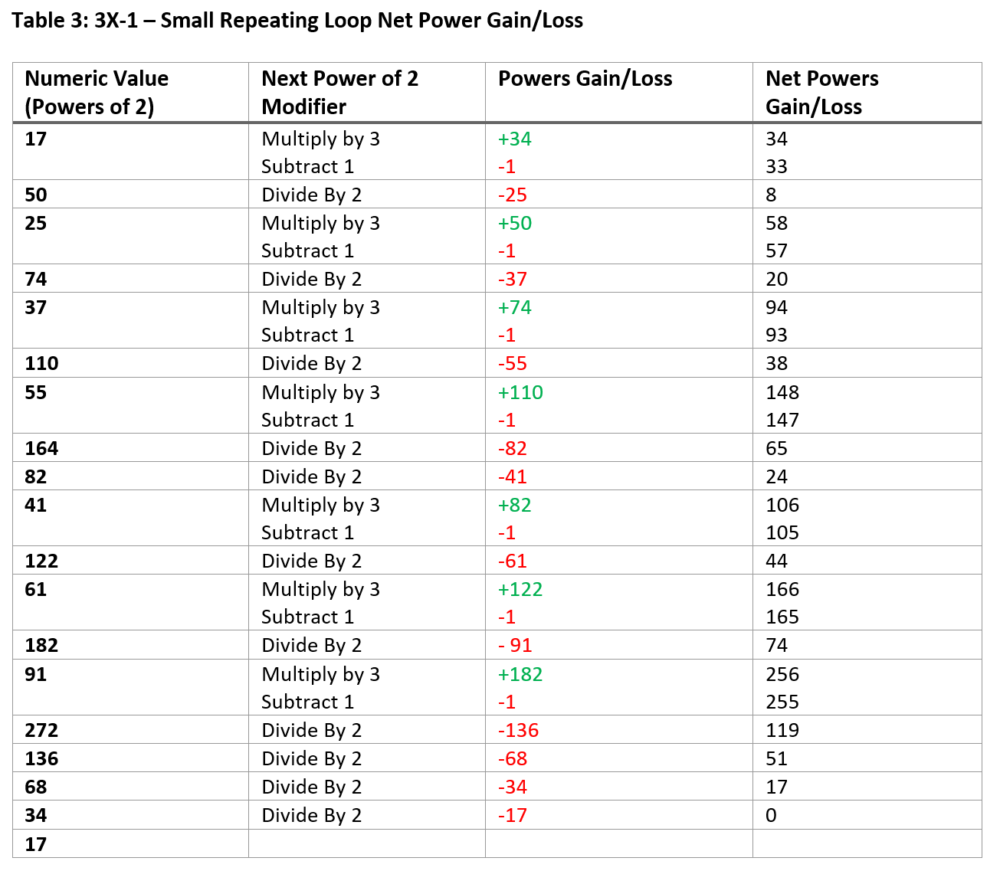

# A Logical Software Engineering Approach to How the Collatz Conjecture Always Results in a Value of 1 Within Finite Iterations

Author: Max La Coste

Date: 06/12/2024

## Abstract
In attempt to prove the Collatz Conjecture focus will be towards the aspect of how the Conjecture interacts with the starting integer’s powers of 2 as the function progresses recursively.

By observing the behaviour using the computer binary system we can visually see the integer in the form of the powers of 2. 

This approach will focus on exploring what causes the initial integer’s current lowest power of 2 to always outgrow and consume all the rest until only it remains.

Building on gained understanding we can then approach why negative numbers behave differently and why other variants may not behave the same as 3X+1 by comparing the behaviour to disprove the 5X+1 variant.

## Introduction 
The Collatz Conjecture has been around for many years evading a logical proof that any positive integer will become 1 within finite iterations. The idea is simple, if a number is odd, we multiply it by 3 and add 1, but when it is even, we divide by 2. We follow these two rules repeatedly until a number results in 1.

A huge number of integers have been tested via brute force and have all successfully reduced down to 1. However, we simply cannot extend this to say this is guaranteed for all numbers. 

This proof claims logic and basic math can provide evidence that for any positive integer used within the 3X+1 Collatz Conjecture it is:
1.	Impossible to get stuck in a non-trivial loop
2.	Impossible to not reduce down to the repeating 4 -> 2 -> 1 loop within finite iterations.

## Powers of 2 and Simple Math
In attempt to prove the Collatz Conjecture, other than knowledge of the power of 2 system, we only need to understand simple concepts that apply to all numbers:
1.	If we multiply by 3, an integer will become 3 times as large.
2.	If we divide by 2, an integer will become twice as small.
3.	If we add a positive value an integer it will increase in size.

Within the Collatz Conjecture there are no exceptions to these rules.

## A Balance of the Powers of 2
The pattern of multiplying by 3 and adding 1 makes the Collatz Conjecture really interesting to explore if looked at through the powers of 2 that form the integer.

Other than keeping our integer odd, the multiplication keeps a baseline of increasing our integer’s powers of 2 by 3 times as many as it had previously.

The core argument presented below for proving the conjecture is related to what the +1 does in combination to the multiplication of 3. The total added to the current lowest power of 2 will cause it to always increase from 1 to 4 which will never cause a combination of lesser powers of 2 needing to be added to the integer. This will be explored in more detail to show uniqueness with 3X+1 when disproving the 5X+1 variant.

## It Is Counterintuitive 
At the face of it, it would appear impossible that simply adding a single power of 2 to an integer could force it to always reach a whole power of 2 if we are repeatedly multiplying by 3.

The approach here is not to suggest an integer will grow until it becomes a power of 2. Instead, the idea is that the integer gains an increase of 1 power of 2 each addition which causes the current lowest power of 2 to always outgrow the multiplication rate. This will have a direct effect of reducing the integer in size through divisions until it reduces down towards a power of 2.

## Basic Binary Addition
We need the understanding of basic binary addition before exploring 3X+1.

In Figure 1 below we can see an integer with an arbitrary value of 9 increase by one power of 2 each time to reach 16 which is a larger whole power of 2.

This is nothing we would not expect. The binary representation demonstrates how each power of 2 overflows upward into the next as each power of 2 slot can only hold half as much value as the next.

The pattern of how each addition makes progress to fill the gaps between the lowest powers of 2 before moving up to the next is basic binary addition. The lower power of 2 slots will fill until they are full, causing the next addition to result in an overflow into a higher whole power of 2 (e.g. 15 overflowing to 16 in Figure 1).

This concept of adding a single power of 2 (adding 1) causing overflows upwards is fundamental to understanding the argument presented below on the behaviour of the Collatz Conjecture.

## 1X+1 Variant
To understand why a single addition of a power of 2 would cause 3X+1 to always reach a whole power of 2, let us first look at the 1X+1 variant. 

We will follow the same format of multiplying, adding, then dividing.

Using programming, starting with an arbitrary value of 9, we can see the values will be generated as below in Figure 2.

The output above in Figure 2 shows what would be intuitively expected, we reach 1. As the multiplication of 1 does not change the value, we are only adding 1 and dividing. But the reason this is important is because we need to spot what is actually happening when we add this single power of 2 each time.

The concept for 1X+1, 3X+1 and any other potential variant is that the potential final power of 2 is always visible in binary. The potential final power of 2 is the current lowest power of 2. This lowest power of 2 needs precise requirements to outgrow and overflow upward through all the others, one by one.

The reason we know 1X+1 will always reach a power of 2 is because the lowest power of 2 will keep overflowing upwards as shown in Figure 1. As only the lowest power of 2 within X will be affected by the +1, this means our current lowest power of 2 is always growing at a faster rate than the others and will cause an overflow upwards each addition. 1X+1 will always eventually outgrow 1X.

The divisions are also crucially significant when it comes to 3X+1, but the reason why can be shown with 1X+1. Figure 2 shows whenever the addition causes the current lowest power of 2 to overflow upwards, the divisions reduce the integer down until the next now current lowest power of 2 is reduced to 1 (being placed in the rightmost binary slot). Reducing down this current lowest power of 2 allows it be affected by the next +1 equally as the previous time, causing it to overflow upwards, and so on.

The ratio of divisions to multiplications is never important. The only importance regarding divisions is they must reduce the current lowest power of 2 down all the way to the lowest binary slot before the next multiplication. This will always happen as in any variant multiplications can only happen if the integer is currently odd.

This process of addition and division repeats until the current lowest power of 2 overflows through all the higher powers of 2 within finite iterations and will result in X reaching a whole power of 2.

## 3X+1
The next concept to explore is why 3X+1 would also reach a power of 2. We need to see how the multiplication of 3 cannot stop us reaching a whole power of 2 in the same way. The reason is the same as 1X+1. The current lowest power of 2 will keep overflowing upward faster than the rest of the integer’s powers of 2.

Below we will explore how the multiplication of 3 does not cause the integer to outgrow the pace of adding 1(a single power of 2) due to the division stages changing where our next addition is placed within X’s powers of 2. 

Let’s explore this with an example of 3X+1 with an arbitrary starting value of 209 below in Figure 3.

Similar to 1X+1, we are still only ever having the +1 overflow the current lowest power of 2 that currently forms X, before being divided and repeatedly overflowing the next, and so on.

This is not seen too well above because the divisions hide the momentum. To see this more clearly, below we can watch 3X+1 using the same starting value of 209, but without the division stages.

<b>Note 1: It is important to understand during the real function we do have the divisions and it does make a difference to what is shown below but not in any meaningful or practical way – This below is only to help visualise the concept. In the below example we are not adding a single power of 2, instead we are adding the smallest current power of 2. It does not change the behaviour as it acts exactly as adding 1 when we follow the normal divisions.</b>

When trimming out the divide stages above in Figure 4, and without them performed above in Figure 5, we can see the highlighted powers of 2 are arranged the same way. This shows it does not matter if we are to perform the divide stages(see Note 1 above), we will always end with the same powers of 2 arrangement within X. We can ignore the trailing zeros as we could divide at any point to perfectly match the corresponding value in Figure 4.

With this, we can now see 3X+1 will cause the current lowest power of 2 to grow faster than 3X. The same logic as 1X+1 will grow faster than 1X.

Below in Figure 6 we can see the compared growth patterns of 3X and 3X+1, both with the arbitrary starting value of 2091. 

<b>Note 2: Like before, for 3X+1 below we are instead adding the lowest current power of 2 instead of 1 since we are not dividing. This lets us to visualise the concept as it allows comparison to 3X which cannot be divided by 2.</b>

What we can see above in Figure 6 is that the upper powers of 2 within the value of X will never be altered other than their own growth patterns of 3X until the current lowest power of 2(highlighted yellow) affected by 3X+1 grows more rapidly and repeatedly overflow upwards. We can see these unaffected values shown above underlined in red. 

As 3X+1 will always grow X’s current lowest power of 2 faster than the rest, we can see the path it will take through the section only affected by 3X. The example above in Figure 6 shows the 3X+1 section leaving a trail of zeros which would be all the combined lesser powers of 2 it gains on its way to becoming a final larger power of 2. However, in the non-visual real way with divisions, this will be kept much smaller as we progress as the number decreases.

Below in Figure 7 we can see the exact same thing happening with the 3X+1 and normal divisions. 

Figure 7 above shows the divisions during the iterations with the same initial value of 2091. The divisions make it harder but we can still see the same concept to still be happening. 

We can see the divide stages do not affect these higher powers as dividing only shifts all the powers of 2 downward equally. Figure 7 can be shown to demonstrate this further by showing the same red underlined value not yet affected by 3X+1, identical as seen in Figure 6 above. The yellow highlight also shows our would-be growing power of 2 is repeatedly being divided.

Each time the 3X+1 causes the current lowest power of 2 to outgrow the 3X pattern and overflow upwards, the next now lowest power of 2 is brought down via the division stages.

This causes the counterintuitive reasoning of how the addition of a single power of 2 will cause X to decrease over time. This mix of the addition of a single power of 2 and the divisions together repeatedly cause overflows upward until X’s current lowest power of 2 outgrows all the rest, resulting in it reaching and overflowing into X’s current highest power of 2 (e.g. X overflowing from 5 to reach 16 in Figure 7 above).

Once X’s lowest power of 2 overflows the topmost X will become a power of 2, and will then divide down to 1 (e.g. X reaching 16 in Figure 7 above). 

## The Integers Numeric Value
With understanding of how the 3X+1 with divisions slowly but inevitably causes X’s current lowest power of 2 to continue to outgrow the 3X growth rate, this is the root cause of the seemingly random sequence of divisions to each multiplication.

We will always see at least one division to each multiplication as the +1 always causes a single power of 2 overflow. However, if we look above, there are multiple times where the +1 will cause a chain reaction of multiple powers of 2 overflowing (similar to 15 increasing to 16 in Figure 1). Depending on how many powers overflow upwards at the same time can increase the amount of divisions in a row (e.g. X having multiple chained overflows causing 4 divisions when progressing from 5 to 16 in Figure 7).

## 3X+1 with Negative Numbers
Within 3X+1 non-trivial loops appear with negative numbers. To explain this behaviour, we can use our understanding of how 1X+1 and 3X+1 both become a power of 2 with positive numbers.

The reason can be shown to simply be related to using negative numbers. We would find the same unexpected behaviour when using positive numbers in a variant of 3X-1. Positive numbers using 3X+1 and negative numbers using 3X–1 will result in normal behaviour causing every integer to reduce to 1 (or -1) via ongoing power of 2 overflows. In contrast, positive numbers using 3X–1 will cause the same unexpected behaviour as negative numbers using 3X+1.

Behaviour works differently with negative numbers within 3X+1 because there is no ongoing addition of a single power of 2 causing overflows. Instead, because we are adding a positive to a negative, we are removing a power of 2 from an integer on the negative side. This means the negative number’s lowest power of 2 will not be able to overflow upwards in the same way positive numbers do within 3X+1. 

### 3X–1
We can translate 3X+1 to 3X–1 to allow us the ability of using positive numbers to explore the same workings as using negative numbers within 3X+1. This also allows us to see the -1 is instead reducing X by a power of 2 each time. As we know 3X+1 reaching a whole power of 2 relies on power of 2 overflows caused by the +1, we should not be surprised we see different behaviour with a negative addition. 

### Loops
Because the 3X–1 version will never have the same overflows we can see this means X’s current lowest power of 2 cannot outgrow the rest within finite iterations.
This causes non trivial loops which numbers can get trapped in. It may seem strange for a repeating loop to appear if we are continuously subtracting a power of 2, but we must still factor in the gained powers of 2 the multiplication of 3 causes.

The reasoning we will explore below is that although all integers used within 3X–1 will decrease by a single power of 2 each subtracting stage, these loops are caused by certain patterns of multiplying and dividing. Precise sequences that when combined with the subtraction result in a complete net gain/loss of 0 powers of 2. 

There are 3 know loops with the negative numbers, below we will explore the net power of 2 gain/loss for each of them.

#### Small Loop
Below in Figure 8 we can see the smallest 1 -> 2 -> 1 repeating loop.

Below in Table 1 we can break down the steps to have a net gain/loss of 0 powers of 2 after one cycle of the loop.

#### Middle Loop
Below in Figure 9 we can see the 5 -> 14 -> 7 -> 20 -> 10 -> 5 repeating loop.

Below in Table 2 we can see how we reach a net gain/loss of 0 powers of two during the middle loop cycle.

#### Large Loop
Lastly, Below in Figure 10 we can see the 17 -> 50 -> 25 -> 74 -> 37 -> 110 -> 55 -> 164 -> 82 -> 41 -> 122 -> 61 -> 182 -> 91 -> 272 -> 136 -> 68 -> 34 -> 17 repeating loop.

Below in Table 3 we can see how we reach a net gain/loss of 0 powers of two during the large loop cycle.

### Other Possible Negative Loops
It may be possible that other higher negative loops exist. However, if we know why the negative numbers behave differently is because of the subtraction of a power of 2 each time, we know this will never be a root cause of loops for positive integers within 3X+1. Therefore, the exact number of negative loops existing cannot have real implications for 3X+1 with positive integers.

## Disproving the 5X+1 Variant
Building further on the understanding of how 1X+1 and 3X+1 always become a power of 2, we can use logic to disprove the 5X+1 variation.

When comparing 5X+1 it may seem reasonable to suggest the current lowest power of 2 could also always outgrow and overflow upwards like 1X+1 or 3X+1, but we can disprove this due to the +1.

Below we will explore why although 5X+1 might in theory always cause the lowest power of 2 to outgrow 5X, it is not always true. For this we will look at examples comparing the behaviour of 1X+1, 3X+1 and 5X+1, all with the starting value of 5.

### 1X+1 Starting Value of 5
Figure 11 below shows the 1X+1 iterations with a starting value of 5.

Within Figure 11 we can see our expected behaviour as the lowest power of 2 is caused to overflow and the divisions cause the process to repeat until we reach 1.

### 3X + 1 Starting Value of 5
Figure 12 below shows the 3X+1 iterations with a starting value of 5.

Within Figure 12 we can see similar to 1X+1, during 3X+1 the addition causes an overflow, which allows the lowest power to outgrow the 3X pattern and overflow upwards.

### 5X + 1 Starting Value of 5
Figure 13 below shows the 5X+1 iterations with a starting value of 5.

Unlike the 1X+1 and 3X+1 patterns, the 5X+1 has an issue that causes unexpected behaviour. The 5X+1 causes a non-trivial loop of 13 -> 66 -> 33 -> 166 -> 83 -> 416 -> 208 -> 104 -> 52 -> 26 -> 13.

Figure 13 above shows underlined in red where the +1 first causes an overflow into the 2^1 (second) binary slot. This is significant as all variants of KX+1(where K is an odd positive integer) can cause an overflow into this binary slot due to the +1, except for 3X+1. 

### Lesser Powers of 2
The +1 will always increase X by 1. But for the current lowest power of 2 overflow to keep outgrowing the K multiplication it needs to do this as a whole without splitting apart into lesser powers of 2.

We know that any multiplication and addition stage will only occur on an odd number. This allows us to look at the few possible binary combinations for these variants to prove 1X+1 and 3X+1 will never have their powers split unlike other variants.

To check these values, we only need to check odd numbers between 1 and the next power of 2 above K. Any values higher than K will always contain one of these combinations so will behave the same.

Below in Table 4 we can compare this potential power of 2 splitting occurrence. 

Within Table 4 we can see 1X+1 and 3X+1 will never create a lesser power of 2 during the combined multiplication and addition stage. The uniqueness 3X+1 has over other variants can be seen to be it will never affect the 2^1 binary slot. This is due to the overflow never causing additions of lesser powers of 2 and so always results with this 2^1 slot remaining its previous value. Instead, this 2^1 slot can only be modified during the division stage.

We can see variants with higher K values will have cases where the multiplication and addition stage will result in a combination of lesser power of 2 to be added. This causes the new lowest lesser power of 2 to not have increased from the original enough to have outgrown the K multiplication rate. This can then possibly lead to further unexpected behaviour as this lesser power of 2 can cause direct alterations to when the next multiplication occurs.

## Conclusion
We have explored the root cause of negative numbers causing loops within 3X+1 and looked at the reason why the other variants of KX+1 can cause unexpected behaviour.

We can see that both 1X+1 and 3X+1 will function in the same way. Their multiplication and addition stages will never cause X to gain a lesser power of 2, meaning the lowest power of 2 will always be outpacing the K multiplications growth rate regardless of X’s current value.

This forces 1X+1 and 3X+1 to always have their current lowest power of 2 overflow upward faster than the K multiplication. This leads to the lowest power of 2 inevitably outgrowing all others within finite iterations. The current lowest power of 2 will then become a whole power of 2. Finally, this whole power of 2 will divide down to reach 1.

Therefore, we can logically conclude that the 3X+1 Collatz Conjecture is true.

